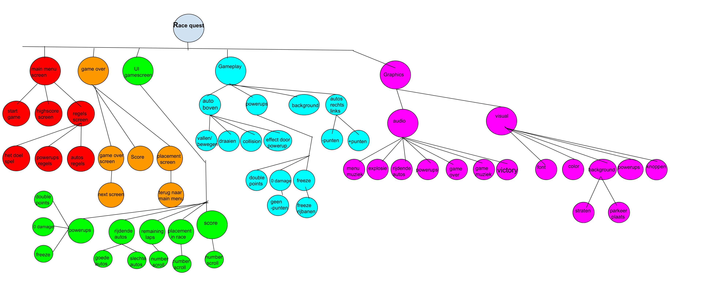

# RaceQuest
RaceQuest is our first game.
It's a game about progressing in a race by solving a tetris-like puzzle with extra twists.

## Who are we?
We are LowLax. We're a team of Game Development students at the Amsterdam University of Applied Sciences (HVA).

## Structure

This is the desired class hierarchy for our game. We might make changes to it when it's more convenient.

## TODOS
- [ ] Add build artifacts.
- [ ] Use a Maven build system and add releases. Will replace artifacts.
- [ ] Automate releases using github workflows.